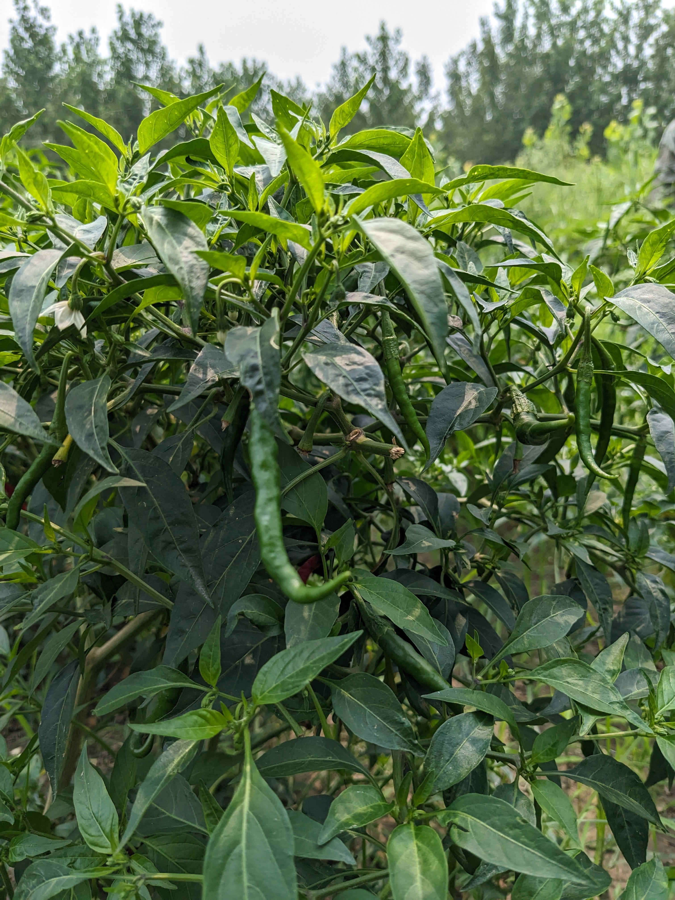
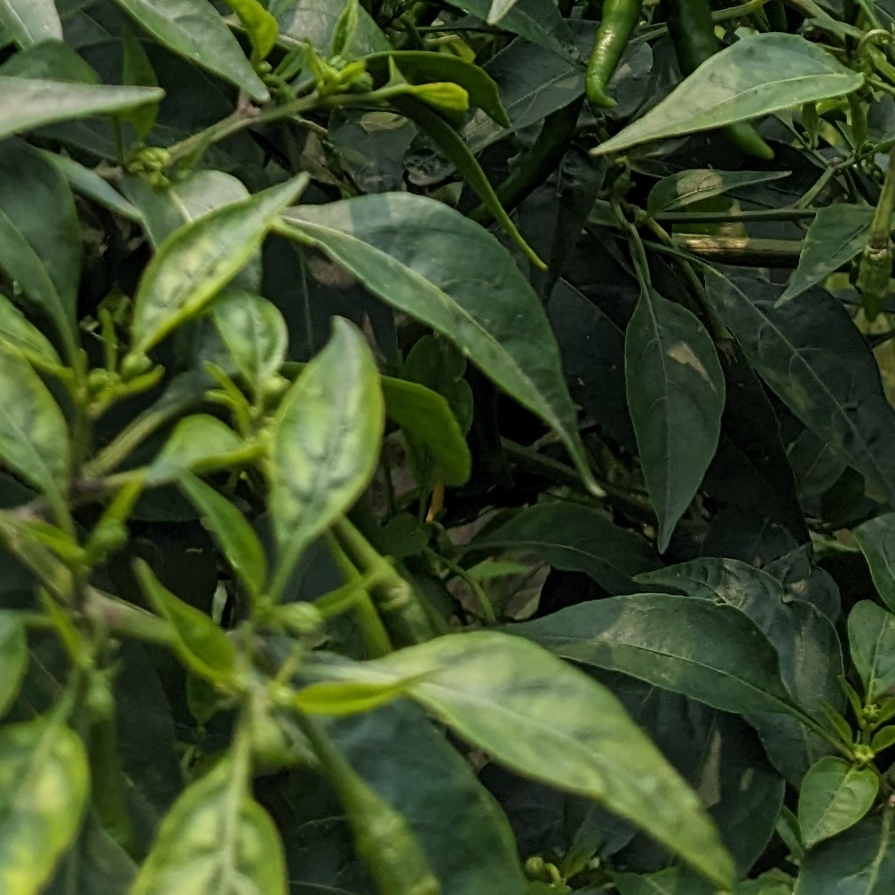
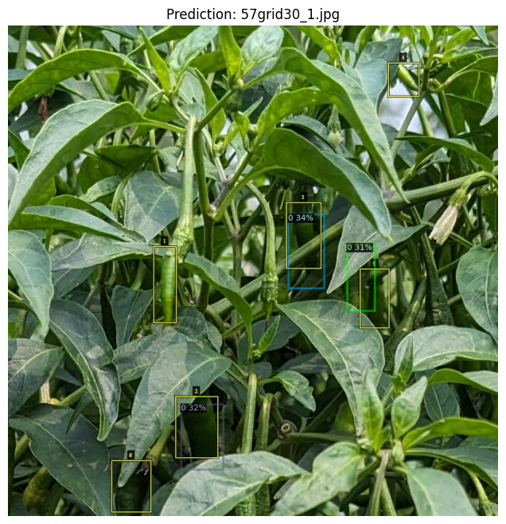
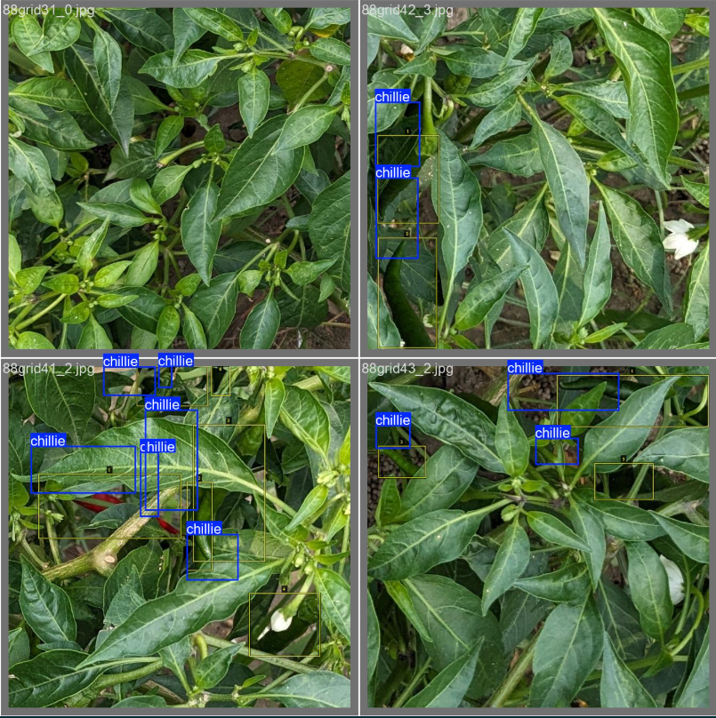
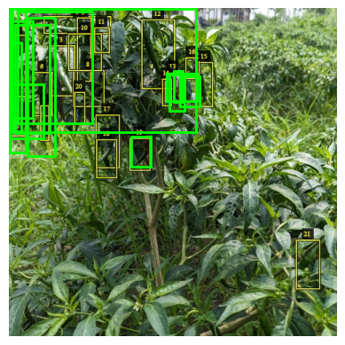

# 🌶️ Chilly Fruit Detection in Chilly Plants using Object Detection Models

## 📌 Overview

This project focuses on detecting **chilly fruits in images of chilly plants** using deep learning-based object detection techniques. Since we initially had only a limited number of images, we adopted a grid-based augmentation strategy, followed by manual annotation, and finally trained multiple models to evaluate performance.

---

## 🖼️ Dataset Preparation

### 1. 📷 Original High-Resolution Image

We began with **92 high-resolution images** of chilly plants, each containing visible chilly fruits. These images formed the base dataset for further augmentation.

> ✅ Example of a high-resolution image:



---

### 2. 🧩 Grid-Based Image Augmentation

To expand our dataset, each high-resolution image was divided into multiple grid patterns:
- 2x2
- 3x3
- 4x4

This increased our dataset from 92 to **2760 cropped images**.

> ✅ Example of an image after 3x3 grid division:



---

### 3. 🏷️ Annotation using VGG Annotator

Each grid image was manually annotated using the **VGG Image Annotator (VIA)**. We used polygon annotations to mark the chilly fruits. The output was saved in `.json` format capturing the coordinates of the annotated regions.

> ✅ Example of an annotated image using VIA:


---

## 🤖 Models Used for Detection

We implemented and trained the following models to detect chilly fruits in the annotated grid images:

### 🔹 1. Detectron2
- Built using Facebook AI's [Detectron2](https://github.com/facebookresearch/detectron2)
- Trained using COCO-style `.json` annotations

>Result for Detectron2


---

### 🔹 2. YOLOv5
- Trained using YOLO annotation format (`.txt`)
- Offers faster inference and better real-time performance

> Result for YOLO

---

### 🔹 3. Faster RCNN
- Faster RCNN the the model before YOLO came gave decent result

> Result for Faster RCNN



---

## 🗂️ Folder Structure

```bash
CHILLY DETECTION/
├── ACPS_Project_Code/
│   ├── Detectron_2.ipynb
│   ├── Faster_RCNN.ipynb
│   └── YOLO.ipynb
├── annoteted images/
│   └── 24/
│       └── 24grid32_1.jpg
├── chilles/
│   └── 20.jpg
├── grid_images/
│   └── 24/
│       └── 24grid32_1.jpg
└── README.md

```


---

## 📌 Conclusion

This project demonstrates how **effective data augmentation and manual annotation** can enable object detection even with limited original data. By training and comparing multiple object detection architectures, we evaluated the most effective approach for chilly fruit detection in agricultural images.

---

## 📬 Future Work

- Expand dataset with more real-world field images
- Apply semantic segmentation for better chilly area estimation
- Deploy the model on edge devices (e.g., Jetson Nano, Raspberry Pi)

---
# Chilly-Detection
